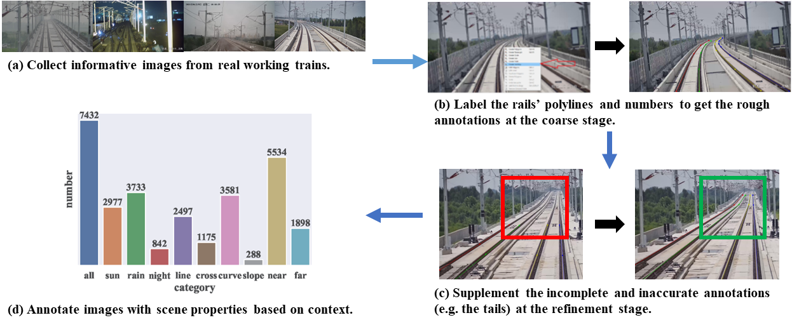
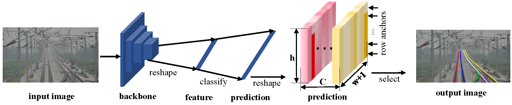
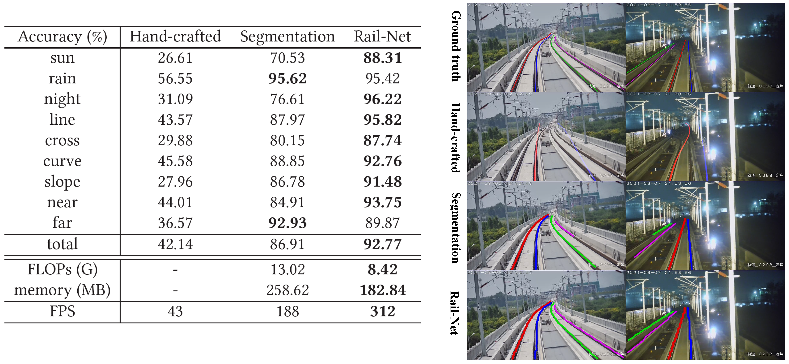

# Railroad-Detection
Rail detection, essential for railroad anomaly detection, aims to identify the railroad region in video frames. Although various studies on rail detection exist, neither an open benchmark nor a high-speed network is available in the community, making algorithm comparison and development difficult. Inspired by the growth of lane detection, we propose a rail database and a row-based rail detection method. 

# Rail-DB
We present a real-world railway dataset, Rail-DB, with 7432 pairs of images and annotations. The images are collected from different situations in lighting, road structures, and views. The rails are labeled with polylines, and the images are categorized into nine scenes. The Rail-DB is expected to facilitate the improvement of rail detection algorithms. The collection pipeline is shown in Fig.1.

  
  Fig.1 - image collection.

<!--  -->

:star: You can download the dataset by sending an email to li.xin.peng@outlook.com. You are supposed to download an agreement form, fill the information and sign in, send the scanned file to the email. An email with dataset download link will come to you. 

# Rail-Net
We present an efficient row-based rail detection method, Rail-Net, containing a lightweight convolutional backbone and an anchor classifier. Specifically, we formulate the process of rail detection as a row-based selecting problem. This strategy reduces the computational cost compared to alternative segmentation methods.

  
  Fig.2 - Rail-Net archetecture.

:star:train scripts

:star:test scripts

# Experiments
We evaluate the Rail-Net on Rail-DB with extensive experiments, including cross-scene settings and network backbones ranging from ResNet to Vision Transformers. Our method achieves promising performance in terms of both speed and accuracy. Notably, a lightweight version could achieve 92.77\% accuracy and 312 frames per second. The Rail-Net outperforms the traditional method by 50.65\% and the segmentation one by 5.86\%.

  
  Fig.3 - Quantitative and qualitative results.

:star:pretrained models
